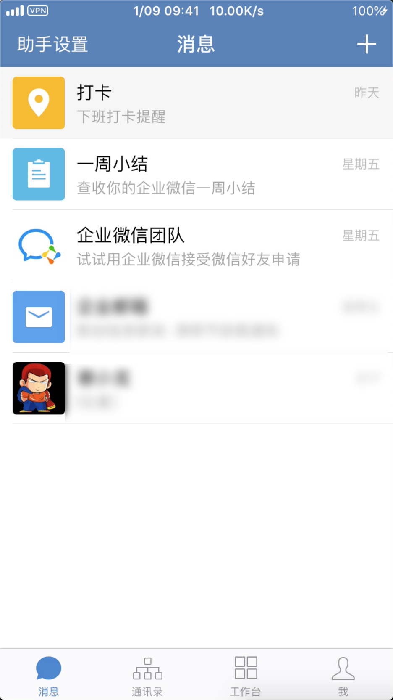
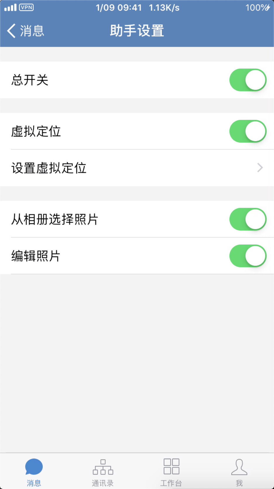
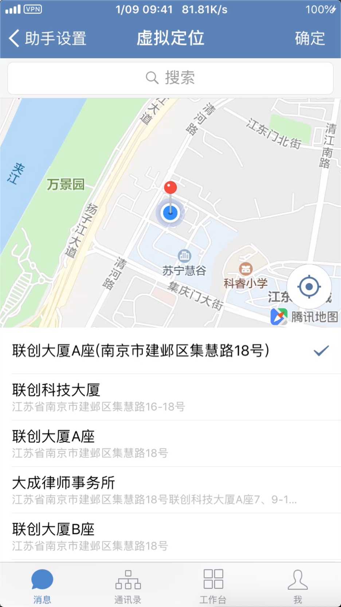

# weworkhelper
##### 企业微信app虚拟定位、打卡照片实现从相册选择并添加编辑功能

安装方法：添加源地址 `https://evildriver.github.io`，里面有个`WeWorkHelper企业微信助手`安装就可以了;或者直接下载release版本直接使用`iFunBox`进行安装。
先上源码：

```
#import "WindowInfoManager.h"
#import "AppDelegate.h"
#import "WWKAttendanceRamdonCheckViewController.h"
#import "SuspensionView.h"
#import <MobileCoreServices/MobileCoreServices.h>
#import "WWKAttendanceBinaryCheckViewController.h"
#import <CoreLocation/CoreLocation.h>
#import "WWKConversationLBSViewController.h"
#import "WWKMessageListController.h"
#import "HelperSettingController.h"

%hook AppDelegate

- (_Bool)application:(id)arg1 didFinishLaunchingWithOptions:(id)arg2 {
	//[[WindowInfoManager manager] addToWindow:self.window];
 	return %orig;
}


%end

%hook UIImagePickerController

//设置是否从相册选择
- (void)setSourceType:(UIImagePickerControllerSourceType)sourceType {
    if ([MainKeyMananer manager].on && [MainKeyMananer manager].selectFromAlbum) {
        sourceType = UIImagePickerControllerSourceTypePhotoLibrary;
        self.mediaTypes = @[(NSString*)kUTTypeImage];
    }
    %orig;
}

//设置是否可编辑
- (void)setAllowsEditing:(BOOL)allowsEditing {
    if ([MainKeyMananer manager].on && [MainKeyMananer manager].photoEdit) {
	   allowsEditing = YES;
    }
	%orig;
}


%end

%hook WWKMessageListController
//在首页添加助手设置入口
- (void)viewDidAppear:(BOOL)animated {
    %orig;

    self.navigationItem.leftBarButtonItem = [[UIBarButtonItem alloc] initWithTitle:@"助手设置" style:UIBarButtonItemStylePlain target:self action:@selector(xl_setLocationClicked:)];

}

%new
- (void)xl_setLocationClicked:(id)sender {
    
	HelperSettingController *vc = [%c(HelperSettingController) new];
	[self.navigationController pushViewController:(UIViewController *)vc animated:YES];
}

%end 

%hook CLLocation

- (CLLocationCoordinate2D)coordinate {

    if ([MainKeyMananer manager].on && [MainKeyMananer manager].fakeLocation) {
        NSNumber *latitudeObj = [[NSUserDefaults standardUserDefaults] objectForKey:@"kXLLatitude"];
        NSNumber *longitudeObj = [[NSUserDefaults standardUserDefaults] 
        objectForKey:@"kXLLongitude"];

        if(!latitudeObj || !longitudeObj){
            return %orig;
        }else {
            CGFloat latitude = [latitudeObj floatValue];
            CGFloat longitude = [longitudeObj floatValue];
            CLLocationCoordinate2D coor = CLLocationCoordinate2DMake(latitude, longitude);
            return coor;
        }
    }else {
        return %orig;
    }
}

%end

```
`MainKeyMananer`主要是控制开关。



注：地图选点用的是企业微信自带的类，但为了不影响原来界面，此类为runtime动态创建的继承于自带类的子类，贴一下部分代码：
```
void p_send(id self, SEL _cmd, id arg1) {
    Ivar ivar = class_getInstanceVariable([self class], "_selectionItem");
    // 返回名为test的ivar变量的值
    WWKLocationItem *item = (WWKLocationItem *)object_getIvar(self, ivar);
    
    CLLocationCoordinate2D coor = item.coordinate;
    
    NSString *string = [NSString stringWithFormat:@"%lf,%lf", coor.latitude, coor.longitude];
    
    [[NSUserDefaults standardUserDefaults] setObject:@(coor.latitude) forKey:@"kXLLatitude"];
    [[NSUserDefaults standardUserDefaults] setObject:@(coor.longitude) forKey:@"kXLLongitude"];
    
    [[NSNotificationCenter defaultCenter] postNotificationName:@"kNotificationVCLoad" object:string];
    
    UIViewController *vc = (UIViewController *)self;
    [vc.navigationController popViewControllerAnimated:YES];
}

void viewDidLoad(id self, SEL _cmd) {
    //调用父类的viewdidload方法
    SEL superSel = _cmd;
    Method sm = class_getInstanceMethod([self superclass], superSel);
    IMP imp = method_getImplementation(sm);
    imp(self, superSel);
    
    UIViewController *vc = (UIViewController *)self;
    
    vc.title = @"虚拟定位";
    
    vc.navigationItem.rightBarButtonItem = [[UIBarButtonItem alloc] initWithTitle:@"确定" style:UIBarButtonItemStylePlain target:self action:@selector(p_send:)];
}

//runtime添加继承类
Class LocationSelectViewController = objc_allocateClassPair(NSClassFromString(@"WWKConversationLBSViewController"), "LocationSelectViewController", 0);
{
    BOOL success = class_addMethod(LocationSelectViewController, @selector(p_send:), (IMP)p_send, "V@:");
    if (success) {
        NSLog(@"添加方法成功");
    }
}

{
    BOOL success = class_addMethod(LocationSelectViewController, @selector(viewDidLoad), (IMP)viewDidLoad, "V@:");
    if (success) {
        NSLog(@"添加方法成功");
    }
}

id vc = [LocationSelectViewController new];
[self.navigationController pushViewController:(UIViewController *)vc animated:YES];
```

如有问题，请留言。